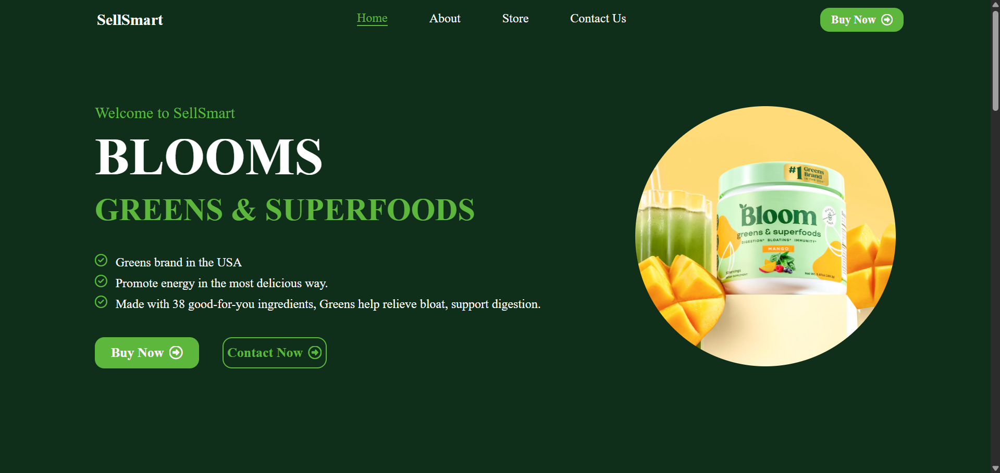
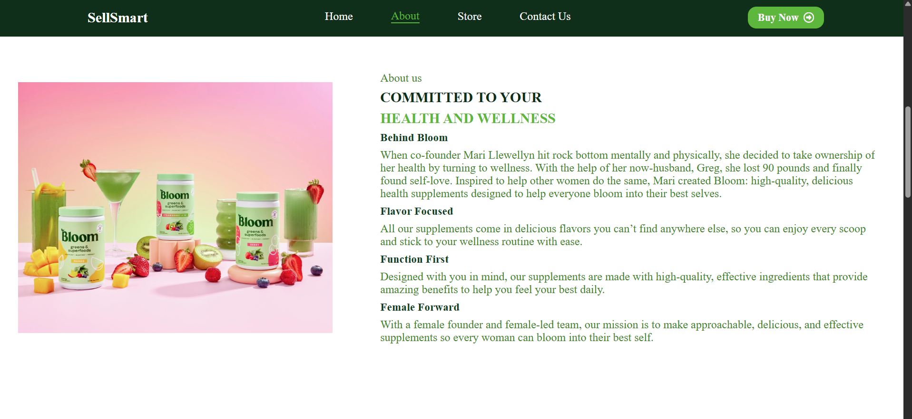
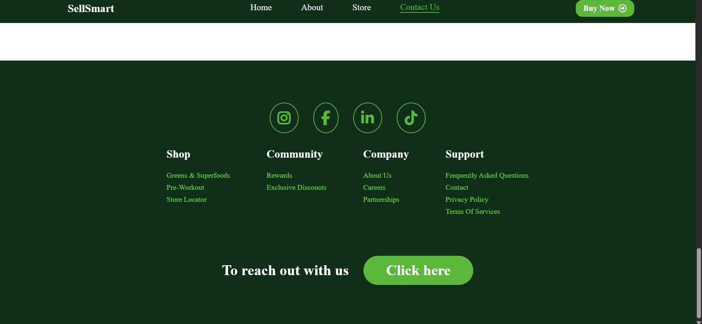

# SellSmart – E-commerce Store Page

A modern, responsive store page built with HTML, CSS, and JavaScript, showcasing health and wellness products in an organized, clean, and interactive layout. Built as part of an internship task to demonstrate front-end development and UI skills.

# Project Overview

The *SellSmart Store Page* presents a professional layout of various wellness products. It includes navigation, product cards, pricing details, interactive buttons, and is designed to offer a pleasant user experience on both desktop and mobile devices.

# Key Features

- Fixed Navigation Bar – Always accessible for smooth user navigation. 
- Hero Section – Clean banner design at the top of the store. 
- Product Cards – Display product name, image, flavor/variant, and pricing. 
- Add to Cart Buttons – Fully styled and ready for functional enhancement. 
- Responsive Layout – Works across desktops, tablets, and mobile devices. 
- Organized File Structure – Clean separation of HTML, CSS, JS, and assets. 
- Sidebar Dropdown (Mobile) – Hamburger menu with collapsible nav links. 
- Font Awesome Integration – Clean icons for modern UI. 
- Active Navigation Highlight – Highlights current section dynamically. 
- SEO-Friendly Semantics – Clean use of HTML tags like `section`, `main`, etc. 
- Cross-browser Compatibility – Runs smoothly in Chrome, Edge, Firefox. 

# Folder Structure

SellSmart/ 
│ 
├── index.html           # Main homepage (includes About & Contact). 
├── store.html           # Store page with product listings. 
├── style.css            # Common styles used across the site. 
├── store.css            # Store-specific styling. 
├── app.js               # JavaScript for UI interactions (dropdowns, cart). 
├── /assets              # Product and banner images. 
└── README.md            # Documentation. 

# Getting Started

1. Download or clone this repo 
2. Open `open index.html` in your browser. 
3. Make sure all image assets and stylesheets are correctly linked. 

# Future Scope / Enhancements

- Implement functional shopping cart using `localStorage`. 
- Create a Checkout or Cart Summary page. 
- Add product categories and filters (by flavor, type, price). 
- Add quantity selection and cart badge counter. 
- Add success modal or alert on adding to cart. 
- Animate transitions on hover and scroll. 
- Add a backend API for dynamic product data. 

# Tech Stack

- HTML 
- CSS3 (Flexbox, Grid, Media Queries) 
- JavaScript (Vanilla JS Font Awesome (via CDN)) 

# Live Preview

- link : https://akankshap-vaultofcodes-final-project.netlify.app

- Screenshots :

# Developer

Akanksha Pawar 
Computer Engineering student  
*Nashik, India* 
